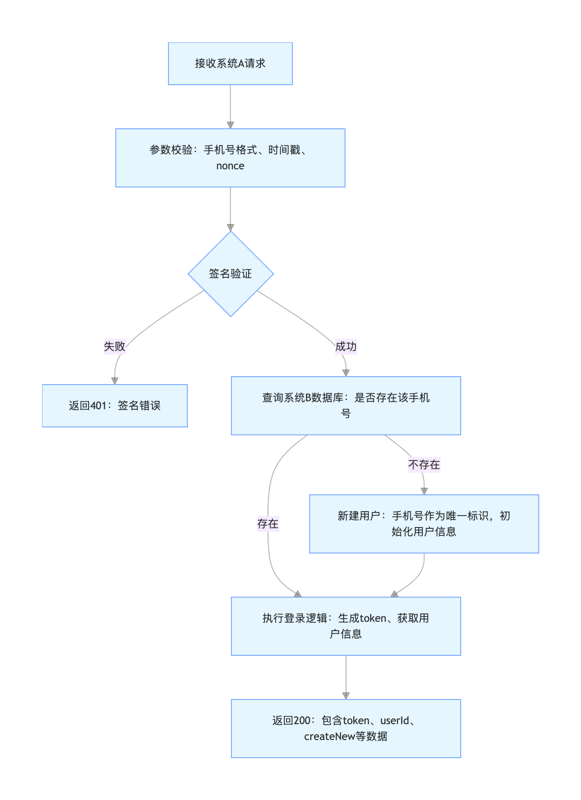

# SysATalk2B
Communication between System A &amp; System B

## Problems

两个系统，系统A，系统B

系统A登录后，有唯一手机号。
系统B提供一个接口，让系统安全调用，传参数手机号号码。
系统B收到接口请求后，查看系统B有没有该手机号：
有 ->  直接在该系统用手机号码的登录，按照登录流程返回数据
没有 ->	立马新建用户，并用新建的账户登录，按照登录信息返回给系统A

这个接口如何设计，保证接口安全高效调用。

## Reselution

一、接口整体设计思路
要实现安全、高效的跨系统手机号登录 / 注册接口，核心要解决 身份认证、数据加密、防篡改、防滥用 四大安全问题，同时保证接口逻辑简洁高效。以下是完整的接口设计方案，包含接口规范、安全机制、核心逻辑和代码示例。
二、接口详细设计
1. 基础接口信息（RESTful 规范）
表格
项	内容
接口地址	https://api.系统B域名.com/v1/auth/mobile-login
请求方式	POST（避免 GET 参数泄露，支持复杂参数 + 加密）
数据格式	JSON（高效解析，跨语言兼容）
超时时间	3s（系统 B 需快速响应，避免系统 A 等待）
2. 安全机制设计（核心）
（1）身份认证：AppID + 签名（Sign）机制
系统 A 和系统 B 提前约定：AppID（系统 A 唯一标识）、AppSecret（密钥，仅双方知晓，绝不传输）。
签名生成规则（防篡改、防重放）：
plaintext
签名串 = MD5(AppID + 时间戳 + 手机号 + AppSecret)
时间戳（timestamp）：毫秒级，用于防重放（系统 B 验证请求时间差≤5 分钟）。
签名串（sign）：通过不可逆加密生成，系统 B 用相同规则校验，确认请求来自合法的系统 A 且参数未被篡改。
（2）数据传输安全
强制使用 HTTPS 协议（传输层加密，防止数据被抓包窃取）。
敏感参数（手机号）可选额外加密（如 AES），进一步提升安全性。
（3）防滥用 / 限流
系统 B 对系统 A 的 AppID 设置接口限流（如 100 次 / 分钟），防止恶意调用。
增加 IP 白名单（仅允许系统 A 的服务器 IP 访问该接口）。
3. 请求参数设计
表格
参数名	类型	是否必传	说明
appId	String	是	系统 A 的唯一标识（由系统 B 分配）
mobile	String	是	手机号（格式：11 位数字，系统 A 提前校验格式）
timestamp	Long	是	毫秒级时间戳（如：1710888888888）
sign	String	是	签名串（按规则生成，32 位 MD5 小写）
nonce	String	是	随机字符串（如：8a9b7c6d），提升签名唯一性，防止重放攻击
4. 响应参数设计
表格
参数名	类型	说明
code	Int	响应码（200 = 成功，400 = 参数错误，401 = 签名验证失败，500 = 系统 B 内部错误）
msg	String	响应信息（如："登录成功"、"签名验证失败"）
data	Object	登录数据（成功时返回，失败时为 null）
├ token	String	系统 B 的登录令牌（供系统 A 后续调用系统 B 接口使用）
├ userId	String	系统 B 的用户唯一 ID（新建 / 已有用户的 ID）
├ mobile	String	手机号
├ createNew	Boolean	是否是新建用户（true = 新建，false = 已有）
5. 核心业务逻辑（系统 B 端）

失败

成功

存在

不存在

接收系统A请求

参数校验：手机号格式、时间戳、nonce

签名验证

返回401：签名错误

查询系统B数据库：是否存在该手机号

执行登录逻辑：生成token、获取用户信息

新建用户：手机号作为唯一标识，初始化用户信息

返回200：包含token、userId、createNew等数据

三、代码示例（Java Spring Boot 实现系统 B 接口）
1. 依赖（pom.xml）
xml
<!-- HTTPS相关 -->
<dependency>
    <groupId>org.springframework.boot</groupId>
    <artifactId>spring-boot-starter-web</artifactId>
</dependency>
<!-- 加密相关 -->
<dependency>
    <groupId>commons-codec</groupId>
    <artifactId>commons-codec</artifactId>
    <version>1.15</version>
</dependency>
<!-- 限流 -->
<dependency>
    <groupId>com.google.guava</groupId>
    <artifactId>guava</artifactId>
    <version>32.1.3-jre</version>
</dependency>
2. 核心接口实现
java
运行
import org.apache.commons.codec.digest.DigestUtils;
import org.springframework.beans.factory.annotation.Value;
import org.springframework.web.bind.annotation.PostMapping;
import org.springframework.web.bind.annotation.RequestBody;
import org.springframework.web.bind.annotation.RequestMapping;
import org.springframework.web.bind.annotation.RestController;

import javax.servlet.http.HttpServletRequest;
import java.util.HashMap;
import java.util.Map;
import java.util.concurrent.TimeUnit;
import com.google.common.util.concurrent.RateLimiter;

@RestController
@RequestMapping("/v1/auth")
public class MobileLoginController {

    // 系统A的AppID和AppSecret（建议配置在Nacos/配置文件，避免硬编码）
    @Value("${systemA.appId:SYSTEM_A_001}")
    private String systemAId;
    @Value("${systemA.appSecret:abc1234567890def}")
    private String systemASecret;

    // 限流：100次/分钟
    private final RateLimiter rateLimiter = RateLimiter.create(100.0 / 60);

    // 模拟用户数据库
    private final Map<String, User> userDb = new HashMap<>();

    /**
     * 手机号登录/注册接口
     */
    @PostMapping("/mobile-login")
    public Map<String, Object> mobileLogin(@RequestBody Map<String, Object> requestParam, HttpServletRequest request) {
        Map<String, Object> result = new HashMap<>();

        // 1. 限流校验
        if (!rateLimiter.tryAcquire(1, TimeUnit.SECONDS)) {
            result.put("code", 429);
            result.put("msg", "请求过于频繁，请稍后重试");
            result.put("data", null);
            return result;
        }

        try {
            // 2. 基础参数校验
            String appId = (String) requestParam.get("appId");
            String mobile = (String) requestParam.get("mobile");
            Long timestamp = (Long) requestParam.get("timestamp");
            String sign = (String) requestParam.get("sign");
            String nonce = (String) requestParam.get("nonce");

            if (appId == null || mobile == null || timestamp == null || sign == null || nonce == null) {
                result.put("code", 400);
                result.put("msg", "参数缺失");
                result.put("data", null);
                return result;
            }

            // 校验手机号格式（11位数字）
            if (!mobile.matches("^1[3-9]\\d{9}$")) {
                result.put("code", 400);
                result.put("msg", "手机号格式错误");
                result.put("data", null);
                return result;
            }

            // 校验时间戳（5分钟内有效）
            long currentTime = System.currentTimeMillis();
            if (Math.abs(currentTime - timestamp) > 5 * 60 * 1000) {
                result.put("code", 400);
                result.put("msg", "请求已过期");
                result.put("data", null);
                return result;
            }

            // 3. 签名校验
            String generateSign = DigestUtils.md5Hex(appId + timestamp + mobile + nonce + systemASecret).toLowerCase();
            if (!systemAId.equals(appId) || !generateSign.equals(sign)) {
                result.put("code", 401);
                result.put("msg", "签名验证失败");
                result.put("data", null);
                return result;
            }

            // 4. 核心业务逻辑：查询/新建用户 + 登录
            boolean createNew = false;
            User user = userDb.get(mobile);
            if (user == null) {
                // 新建用户
                user = new User();
                user.setUserId("USER_" + System.currentTimeMillis()); // 生成唯一ID
                user.setMobile(mobile);
                userDb.put(mobile, user);
                createNew = true;
            }

            // 生成登录token（实际项目建议用JWT，设置过期时间）
            String token = DigestUtils.md5Hex(user.getUserId() + System.currentTimeMillis() + systemASecret);

            // 5. 组装响应数据
            Map<String, Object> data = new HashMap<>();
            data.put("token", token);
            data.put("userId", user.getUserId());
            data.put("mobile", mobile);
            data.put("createNew", createNew);

            result.put("code", 200);
            result.put("msg", "登录成功");
            result.put("data", data);

        } catch (Exception e) {
            // 异常捕获，避免接口崩溃
            result.put("code", 500);
            result.put("msg", "系统内部错误");
            result.put("data", null);
            // 实际项目需记录异常日志
            e.printStackTrace();
        }

        return result;
    }

    // 模拟用户实体
    static class User {
        private String userId;
        private String mobile;

        // getter/setter
        public String getUserId() { return userId; }
        public void setUserId(String userId) { this.userId = userId; }
        public String getMobile() { return mobile; }
        public void setMobile(String mobile) { this.mobile = mobile; }
    }
}
6. 系统 A 调用示例（Java）
java
运行
import org.apache.commons.codec.digest.DigestUtils;
import java.util.HashMap;
import java.util.Map;
import java.util.UUID;

public class SystemAClient {
    // 系统B接口地址
    private static final String API_URL = "https://api.系统B域名.com/v1/auth/mobile-login";
    // 系统A的AppID和AppSecret
    private static final String APP_ID = "SYSTEM_A_001";
    private static final String APP_SECRET = "abc1234567890def";

    public static void main(String[] args) {
        // 要传递的手机号
        String mobile = "13800138000";
        // 1. 生成请求参数
        Map<String, Object> params = new HashMap<>();
        params.put("appId", APP_ID);
        params.put("mobile", mobile);
        params.put("timestamp", System.currentTimeMillis());
        params.put("nonce", UUID.randomUUID().toString().replace("-", "").substring(0, 8)); // 8位随机串

        // 2. 生成签名
        String sign = DigestUtils.md5Hex(
                APP_ID + params.get("timestamp") + mobile + params.get("nonce") + APP_SECRET
        ).toLowerCase();
        params.put("sign", sign);

        // 3. 发送POST请求（实际项目用OkHttp/HttpClient）
        // 此处省略HTTP请求代码，核心是传递JSON参数并接收响应
        System.out.println("请求参数：" + params);
    }
}
四、额外优化建议
token 优化：实际项目中建议用 JWT 生成 token，设置过期时间（如 2 小时），并提供刷新 token 接口。
日志记录：系统 B 记录所有接口请求日志（含 AppID、手机号、请求时间、处理结果），便于问题排查。
数据脱敏：日志中手机号脱敏（如 138****8000），避免敏感信息泄露。
接口版本控制：URL 中加入版本号（如 /v1/），便于后续接口迭代不影响旧版本。
容灾处理：系统 B 的用户数据库建议做集群，避免单点故障；接口请求做幂等处理（防止重复新建用户）。
总结
安全核心：通过 AppID+AppSecret+签名 实现身份认证和防篡改，HTTPS 保障传输安全，限流 + IP 白名单防滥用。
高效核心：接口逻辑极简（查询→登录 / 新建→登录），JSON 格式解析高效，设置合理超时时间和限流规则。
关键规范：遵循 RESTful 设计，参数校验前置，异常统一处理，响应码语义清晰。
